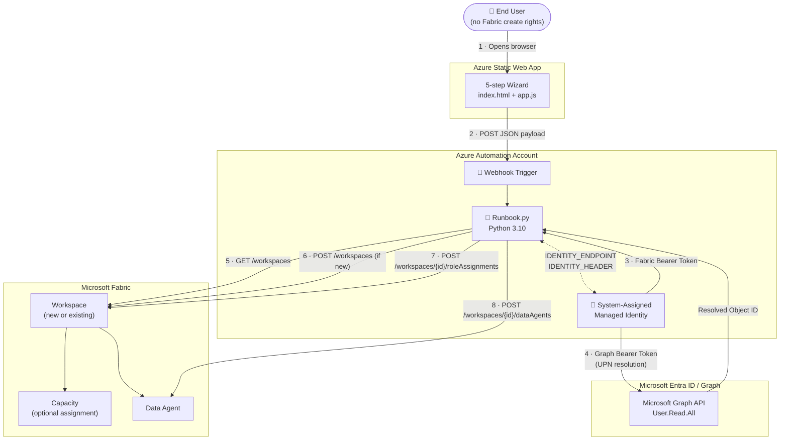
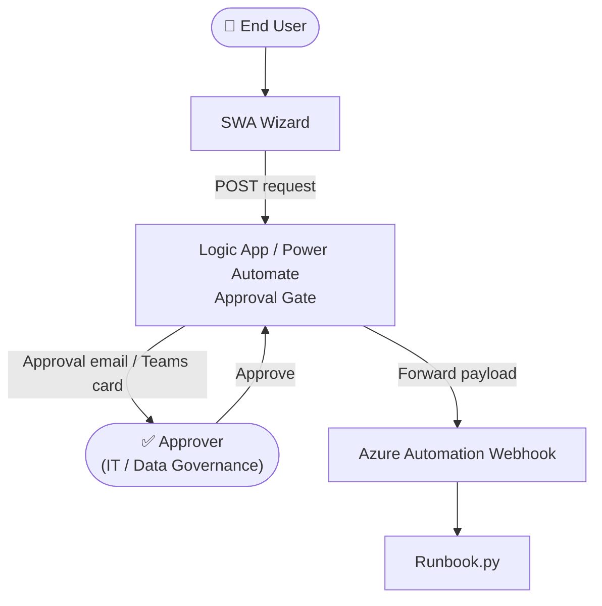

# Architecture & How It Works

[← Back to README](../README.md)

---

## Context & Problem

Many organizations want to harness the power of Microsoft Fabric for specific use cases — Data Agents, Lakehouses, Notebooks — without opening all Fabric capabilities to every user. The main concerns are:

- **Overconsumption of capacity** in environments where Power BI workloads already run
- **Duplication** with existing cloud or data platform investments
- **Governance** — who can create what, and where

The Fabric product group is working on granular workload deactivation, but it is not yet generally available. This solution answers: *How do we enable targeted, controlled, gradual access to specific Fabric items without compromising costs, governance, and performance?*

---

## Solution Overview

```
End user (no Fabric creation rights)
    │
    ▼
Azure Static Web App (wizard UI)
    │
    │  POST {workspace_name, agent_name, capacity_name, admin_user}
    ▼
Azure Automation Webhook
    │
    ▼
Azure Automation Runbook (Python 3.10)
    │  System-Assigned Managed Identity
    ├─► Fabric REST API  ── create/find Workspace, assign Capacity, create Data Agent
    └─► Microsoft Graph  ── resolve UPN → Object ID (optional), assign workspace roles
```

**Key principle**: the end user never needs the right to create Fabric items. The Runbook acts on their behalf, creates the item, and grants them the minimum required workspace role upon success.

---

## Architecture Diagram



### With Optional Approval Step

When an approval workflow is added (see [Approval Workflow](approval-workflow.md)), the flow becomes:



---

## Component Descriptions

| Component | Role |
|---|---|
| **Azure Static Web App** | Hosts the wizard UI. No backend — purely static HTML/CSS/JS. Sends form data directly to the Automation webhook (or to a Logic App when approval is enabled). |
| **Azure Automation Account** | Hosts the webhook and the Python 3.10 runbook. Provides compute and identity. |
| **System-Assigned Managed Identity** | The security principal used by the runbook — no secrets, no passwords. Granted access to Fabric APIs and Microsoft Graph via role assignments. |
| **Runbook.py** | Core orchestration: find or create workspace, assign capacity, grant roles, create the Data Agent. Reads parameters from the webhook JSON body. |
| **Microsoft Fabric REST API** | Target platform — workspaces, capacities, items (Data Agents). |
| **Microsoft Graph API** | Used only when an admin user's UPN (email) is provided — resolves it to the Entra Object ID required by the Fabric role assignment API. |
| **Grant-GraphPermission.ps1** | One-time setup script that grants `User.Read.All` (application permission) to the Managed Identity on Microsoft Graph. |
| **Logic App / Power Automate** *(optional)* | Sits in front of the webhook to add an approval gate. See [Approval Workflow](approval-workflow.md). |

---

## Security Model

| Concern | How It Is Addressed |
|---|---|
| No credentials stored | Authentication uses System-assigned Managed Identity exclusively — no secrets, passwords, or API keys |
| Webhook URL exposure | The URL contains a bearer token; treat it as a secret — never commit to source control, rotate periodically |
| Least-privilege | MI has only `User.Read.All` on Graph and Fabric workspace membership — not a global Fabric admin |
| XSS prevention | All user input rendered in the DOM is passed through `escapeHtml()` in `app.js` |
| Input validation | Required fields validated client-side; server-side the runbook exits with code 1 if `workspace_name` or `agent_name` is missing |
| Transport security | SWA is HTTPS-only by default; the Automation webhook endpoint is also HTTPS |
