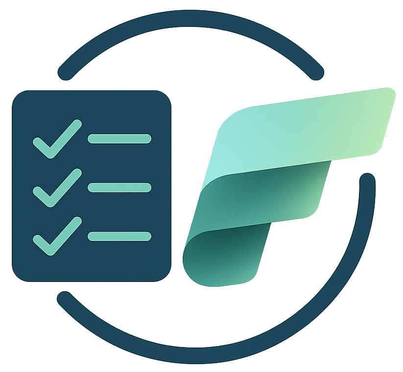
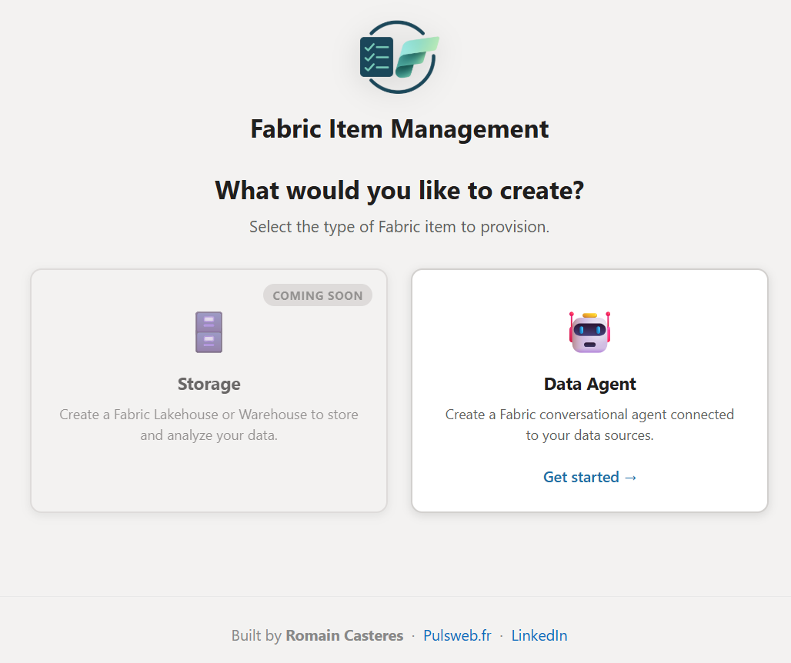
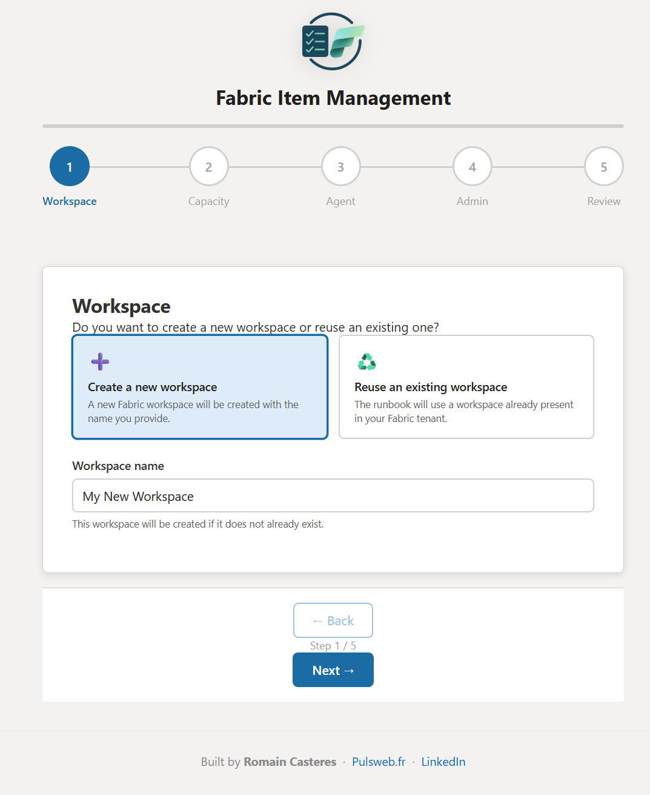
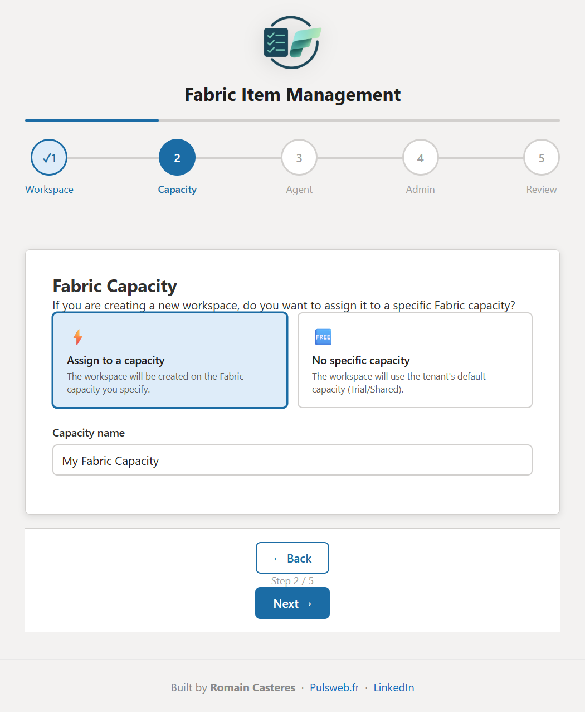
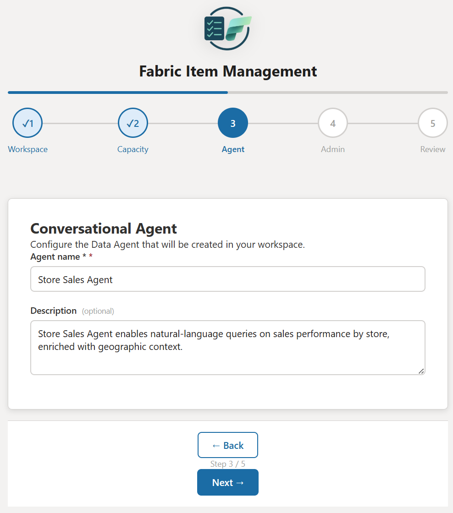
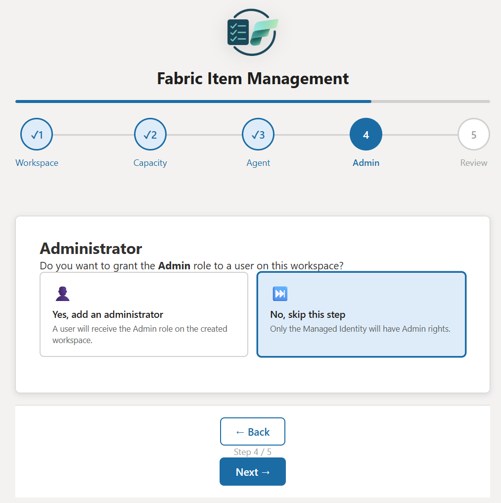
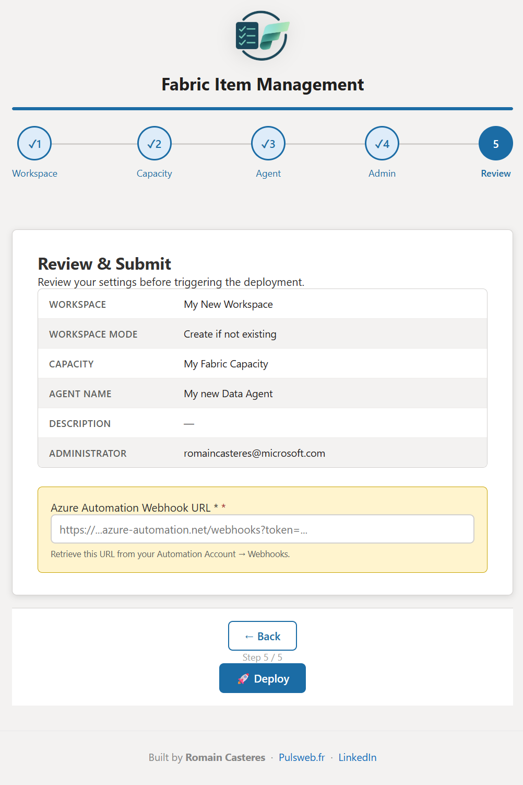
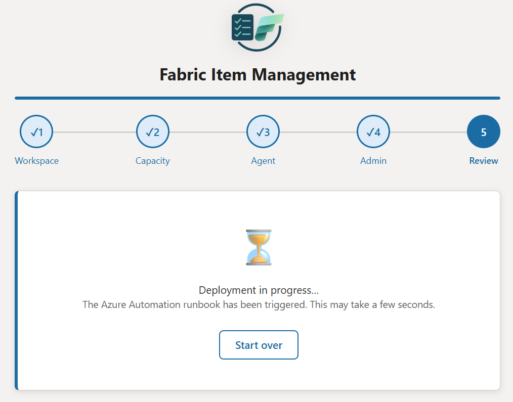

# Fabric Item Management

> **Enabling the controlled use of specific Microsoft Fabric items without exposing them to the entire organization.**

A template solution that lets end users provision Fabric items (starting with Data Agents) through a guided web wizard — without ever needing direct Fabric creation rights. Governance, cost control, and naming conventions are enforced server-side by an Azure Automation Runbook running under a Managed Identity.

---

## Context & Problem

Many organizations want to harness the power of Microsoft Fabric — Data Agents, Lakehouses, Notebooks — without opening all Fabric capabilities to every user. The main concerns are:

- **Overconsumption of capacity** in environments where Power BI workloads already run
- **Duplication** with existing cloud or data platform investments
- **Governance** — who can create what, and where

The Fabric product group is working on granular workload deactivation, but it is not yet generally available. This solution answers: *How do we enable targeted, controlled, gradual access to specific Fabric items without compromising costs, governance, and performance?*

---


## Outcome

### Welcome screen — item type selection


### Step 1 — Workspace


### Step 2 — Fabric Capacity


### Step 3 — Conversational Agent


### Step 4 — Administrator


### Step 5 — Review & Submit


### Step 6 — Deployment triggered


---

## Quick Links

| | |
|---|---|
| 🏗️ [Architecture & How It Works](Docs/architecture.md) | Component diagram, data flow, security model |
| 🚀 [Deployment Guide](Docs/deployment-guide.md) | Run locally (open `index.html`) or deploy to Azure Static Web App |
| ✅ [Approval Workflow](Docs/approval-workflow.md) | Add a human-in-the-loop gate before provisioning |
| 🔧 [Troubleshooting](Docs/troubleshooting.md) | Common errors and fixes |
| 🔭 [Extending the Solution](Docs/extending.md) | Add new item types, audit logging, naming rules |

---

## What It Does

End users open a 5-step wizard in the browser and fill in a workspace name, optional capacity, agent name, and an optional admin user. The form POSTs a JSON payload to an Azure Automation Webhook. A Python Runbook — running as a System-assigned Managed Identity — handles all Fabric API calls server-side. The user never needs Fabric creation rights.

```
End user  →  Azure Static Web App (wizard)
                     │
                     │  POST JSON
                     ▼
          Azure Automation Webhook
                     │
                     ▼
          Azure Automation Runbook (Python 3.10)
          ├─► Fabric REST API  — create workspace, assign capacity, create Data Agent
          └─► Microsoft Graph  — resolve UPN → Object ID, assign workspace roles
```

---

## Repository Structure

```
Fabric-Item-Management/
├── README.md
├── Docs/
│   ├── architecture.md          # Architecture diagram and component descriptions
│   ├── deployment-guide.md      # Step-by-step deployment instructions
│   ├── approval-workflow.md     # Approval workflow integration guide
│   ├── troubleshooting.md       # Common errors and resolutions
│   └── extending.md             # How to add new item types, audit logging, etc.
├── AzureWebApp/                  # Azure Static Web App
│   ├── index.html
│   ├── app.js
│   ├── styles.css
│   └── staticwebapp.config.json
├── AzureAutomation/
│   └── Runbook.py               # Azure Automation Runbook (Python 3.10)
├── Resources/
│   └── Grant-GraphPermission.ps1
└── Media/                        # Screenshots and images
```

---

## Security at a Glance

- **No credentials stored** — authentication uses the System-assigned Managed Identity only.
- **Webhook URL is the only secret** — treat it like a password; do not commit it to source control.
- **Least-privilege** — the Managed Identity has only `User.Read.All` on Graph and membership on target Fabric workspaces.
- **XSS prevention** — all user input is passed through `escapeHtml()` before DOM insertion.

See [Architecture](Docs/architecture.md) for the full security model.

---

## Authors

Co-designed with the invaluable input of [Emilie Beau](https://www.linkedin.com/in/emilie-beau/) and [Christopher Maneu](https://www.linkedin.com/in/cmaneu/), and accelerated using VS Code Copilot and Claude Sonnet 4.6.

---

**Built with ❤️ for the Microsoft Fabric community**


