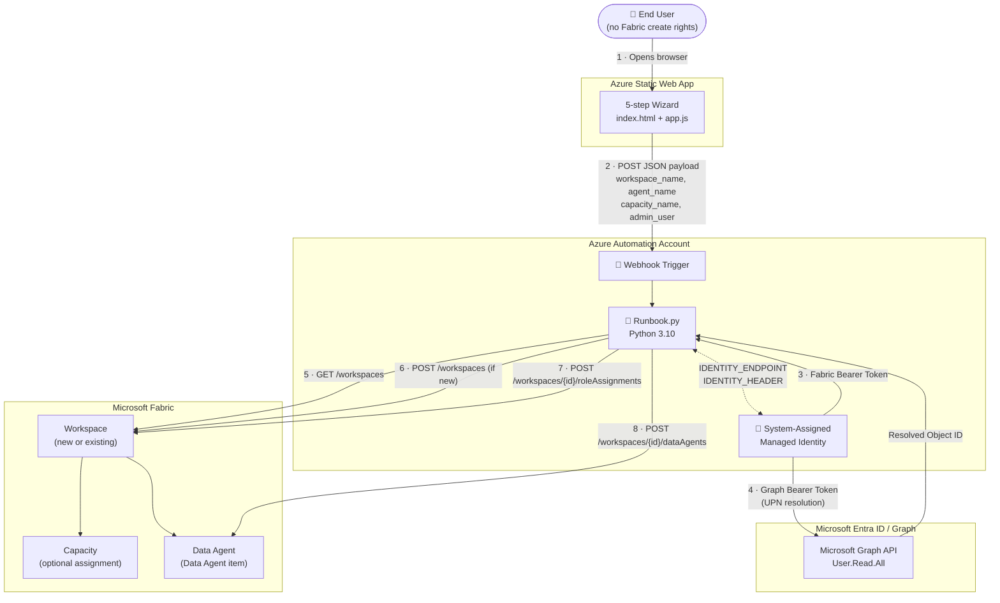

# Fabric Item Management

> **Enabling the controlled use of specific Microsoft Fabric items without exposing them to the entire organization.**

A template solution that lets end users provision Fabric items (starting with Data Agents) through a guided web wizard — without ever needing direct Fabric creation rights. Governance, cost control, and naming conventions are enforced server-side by an Azure Automation Runbook running under a Managed Identity.

---

## Table of Contents

1. [Context & Problem](#1-context--problem)
2. [Solution Overview](#2-solution-overview)
3. [Architecture](#3-architecture)
4. [Repository Structure](#4-repository-structure)
5. [Prerequisites](#5-prerequisites)
6. [Deployment Guide](#6-deployment-guide)
7. [Script Verification & Changes](#7-script-verification--changes)
8. [Testing](#8-testing)
9. [Troubleshooting](#9-troubleshooting)
10. [Extending the Solution](#10-extending-the-solution)
11. [Security Considerations](#11-security-considerations)
12. [Future Vision & Roadmap](#12-future-vision--roadmap)
13. [Authors](#13-authors)

---

## 1. Context & Problem

Many organizations want to harness the power of Microsoft Fabric for specific use cases (e.g., Data Agents for conversational analytics) without opening all Fabric capabilities to every user. The main concerns are:

- **Overconsumption of capacity** in environments where Power BI workloads already run
- **Duplication** with existing cloud or data platform investments
- **Governance** — who can create what, and where

The Fabric Product Group is working on granular workload deactivation, but it is not yet available. The current recommended approach relies on **tenant settings**, **capacity management**, and **spike protection** — not functional deactivation.

This solution answers: *How do we enable targeted, controlled, gradual access to specific Fabric items without compromising costs, governance, and performance?*

---

## 2. Solution Overview

```
End user (no Fabric creation rights)
    │
    ▼
Azure Static Web App (wizard UI)
    │
    │  POST {workspace_name, agent_name, capacity_name, admin_user}
    ▼
Azure Automation Webhook
    │
    ▼
Azure Automation Runbook (Python 3.10)
    │  System-Assigned Managed Identity
    ├─► Fabric REST API  ── create/find Workspace, assign Capacity, create Data Agent
    └─► Microsoft Graph  ── resolve UPN → Object ID (optional), assign workspace roles
```

**Key principle**: The end user never needs the right to create Fabric items. The Runbook acts on their behalf, creates the item, and grants them the minimum required workspace role upon success.

---

## 3. Architecture



### Component Descriptions

| Component | Role |
|---|---|
| **Azure Static Web App** | Hosts the wizard UI. No backend required — purely static HTML/CSS/JS. Sends form data directly to the Automation webhook. |
| **Azure Automation Account** | Hosts the webhook and the Python 3.10 runbook. Provides the compute and identity layer. |
| **System-Assigned Managed Identity** | The security principal used by the runbook — no secrets, no passwords. Granted access to Fabric APIs and Microsoft Graph via role assignments. |
| **Runbook.py** | Core orchestration logic: find or create workspace, assign capacity, grant roles, create the Data Agent. Reads parameters from the webhook JSON body. |
| **Microsoft Fabric REST API** | Target platform — workspaces, capacities, items (Data Agents). |
| **Microsoft Graph API** | Used only when an admin user's UPN (email) is provided — resolves it to the Entra Object ID needed by the Fabric API. |
| **Grant-GraphPermission.ps1** | One-time setup script that grants the `User.Read.All` application permission to the Managed Identity on Microsoft Graph. |

---

## 4. Repository Structure

```
Fabric-Item-Management/
├── README.md
├── AzureWebApp/                       # Azure Static Web App
│   ├── index.html                     # Main page — welcome screen + wizard
│   ├── app.js                         # Wizard logic, validation, webhook call
│   ├── styles.css                     # UI styles
│   └── staticwebapp.config.json       # SWA routing config (404 → index.html)
├── AzureAutomation/
│   └── Runbook.py                     # Azure Automation Runbook (Python 3.10)
├── Resources/
│   └── Grant-GraphPermission.ps1      # One-time Graph permission setup script
└── Media/
    └── Fabric-Item-Management-Logo.png
```

---

## 5. Prerequisites

### Azure Resources

| Resource | Purpose | Notes |
|---|---|---|
| Azure Automation Account | Hosts the runbook and webhook | Python 3.10 runtime required |
| Azure Static Web App | Hosts the wizard UI | Free tier sufficient |
| Microsoft Fabric Capacity | Assigns workspaces to a capacity | Optional — Trial/Shared capacity can be used |

### Required Permissions (before deploying)

| Permission | Granted to | Purpose | How |
|---|---|---|---|
| `Service principals can use Fabric APIs` | Entire tenant | Allows the Managed Identity to call Fabric REST APIs | Fabric Admin Portal → Tenant Settings |
| `User.Read.All` (Graph Application) | Managed Identity | Resolves UPN email addresses to Entra Object IDs | `Resources/Grant-GraphPermission.ps1` |
| Fabric workspace member | Managed Identity | Required only when reusing an **existing** workspace | Manually in Fabric UI |

### Local Tools (for setup)

- [Azure CLI](https://learn.microsoft.com/en-us/cli/azure/install-azure-cli) or Azure Portal access
- [PowerShell](https://learn.microsoft.com/en-us/powershell/scripting/install/installing-powershell) + [Microsoft.Graph module](https://learn.microsoft.com/en-us/powershell/microsoftgraph/installation) (for `Grant-GraphPermission.ps1`)

---

## 6. Deployment Guide

### Step 1 — Create the Azure Automation Account

1. In the Azure Portal, create a new **Automation Account**.
2. When creating (or afterwards in **Identity** → **System assigned**), enable the **System-assigned Managed Identity**.
3. Note the **Object ID** of the Managed Identity (visible in the Identity blade).
4. Ensure the account uses the **Python 3.10** runtime environment. Go to **Runtime Environments** → verify a Python 3.10 environment is available or create one.

> **Tip**: The runbook uses only Python standard-library modules (`json`, `urllib`, `base64`, `time`, `sys`, `os`) plus `automationassets` (built-in in Azure Automation). No extra packages need to be installed.

---

### Step 2 — Enable Fabric API Access for Service Principals

1. Go to the [Microsoft Fabric Admin Portal](https://app.fabric.microsoft.com/admin-portal).
2. Navigate to **Tenant Settings** → **Developer settings**.
3. Enable **"Service principals can use Fabric APIs"**.
4. Optionally restrict this to a specific Entra security group that contains only your Managed Identity.

---

### Step 3 — Grant Graph Permission to the Managed Identity

This step is only required if you want to allow users to specify an admin by **email (UPN)** rather than Object ID.

1. Open `Resources/Grant-GraphPermission.ps1`.
2. **Replace** the placeholder Object ID with the one noted in Step 1:

   ```powershell
   # Replace this value with the actual Managed Identity Object ID from Step 1
   $ManagedIdentityObjectId = "<YOUR-MANAGED-IDENTITY-OBJECT-ID>"
   ```

3. Run the script in a PowerShell session where your account has `AppRoleAssignment.ReadWrite.All` and `Application.Read.All` Graph permissions:

   ```powershell
   # Connect first (admin consent required)
   Connect-MgGraph -Scopes "AppRoleAssignment.ReadWrite.All", "Application.Read.All"

   # Then run the script
   .\Resources\Grant-GraphPermission.ps1
   ```

4. Verify the output ends with: `User.Read.All permission granted to the Managed Identity.`

---

### Step 4 — Import the Runbook

1. In your Automation Account, go to **Runbooks** → **Create a runbook**.
2. Set:
   - **Name**: `FabricItemManagement` (or any name of your choice)
   - **Runbook type**: Python
   - **Runtime version**: 3.10
3. Paste the contents of `AzureAutomation/Runbook.py` into the editor.
4. Click **Save**, then **Publish**.

---

### Step 5 — Create the Automation Webhook

1. In your Automation Account, open the runbook you just published.
2. Go to **Webhooks** → **Add webhook**.
3. Set:
   - **Name**: `FabricItemManagementWebhook`
   - **Enabled**: Yes
   - **Expiry**: Set an appropriate expiry date for your organization
4. **Copy the webhook URL immediately** — it is only shown once.
5. Click **OK** and **Create**.

> The webhook URL will look like:
> `https://<region>.azure-automation.net/webhooks?token=<token>`

---

### Step 6 — Deploy the Azure Static Web App

#### Option A — Azure Portal (recommended for first deployment)

1. In the Azure Portal, create a new **Static Web App** resource.
2. Choose your subscription, resource group, and region.
3. For the deployment source, select **Other** (manual deployment) or connect to your GitHub repository.
4. After creation, use the **Azure Static Web Apps CLI** or drag-and-drop upload to deploy the `AzureWebApp/` folder.

#### Option B — Azure CLI

```bash
# Install the SWA CLI
npm install -g @azure/static-web-apps-cli

# Deploy from the AzureWebApp folder
swa deploy ./AzureWebApp \
  --deployment-token <YOUR-SWA-DEPLOYMENT-TOKEN> \
  --env production
```

#### Option C — GitHub Actions (CI/CD)

If your repository is on GitHub, Azure will automatically generate a GitHub Actions workflow when you link the SWA to your repository. Ensure the **app location** is set to `AzureWebApp/`.

---

### Step 7 — Configure CORS on the Automation Webhook

Azure Automation webhooks support cross-origin requests, but your browser will send a `Content-Type: application/json` pre-flight request. If you encounter CORS errors:

- Verify that your Static Web App domain is **not** blocked by a network policy.
- Azure Automation webhooks **do not require explicit CORS configuration** — they accept requests from any origin.
- If you still run into issues, consider placing an **Azure API Management** instance in front of the webhook to handle CORS headers explicitly.

---

### Step 8 — Configure and Use the App

1. Navigate to your deployed SWA URL.
2. Click **Data Agent** on the welcome screen to start the wizard.
3. Complete the 5-step wizard:
   - **Step 1 — Workspace**: Choose to create a new workspace or reuse an existing one, and provide its name.
   - **Step 2 — Capacity**: Optionally assign the new workspace to a named Fabric capacity.
   - **Step 3 — Agent**: Provide the name (and optional description) for the Data Agent.
   - **Step 4 — Admin**: Optionally assign an admin user (by UPN or Object ID) to the workspace.
   - **Step 5 — Review**: Confirm settings and enter the **Automation Webhook URL** from Step 5.
4. Click **🚀 Deploy** to trigger the runbook.

---

## 7. Script Verification & Changes

### `AzureAutomation/Runbook.py`

#### ✅ Correct behaviors

| Behavior | Details |
|---|---|
| Managed Identity token acquisition | Uses `IDENTITY_ENDPOINT` + `IDENTITY_HEADER` env vars injected by Azure Automation — no secrets stored |
| Workspace discovery | Paginates the `GET /v1/workspaces` response using `continuationUri` |
| Capacity discovery | Paginates the `GET /v1/capacities` response; case-insensitive name match |
| Async operation support | Polls the `Location` header until the Data Agent creation completes |
| Idempotent role assignment | Gracefully handles `PrincipalAlreadyHasWorkspaceRolePermissions` (HTTP 409) |
| Idempotent workspace naming | Returns a descriptive error if the workspace exists but the MI is not a member |
| UPN resolution | Uses Microsoft Graph `GET /v1.0/users/{upn}?$select=id` to convert email to Object ID |
| JWT-based OID extraction | Extracts the MI's own Object ID directly from the Fabric token payload — no extra API call |

#### 🐛 Bug Fixed — Webhook payload was never read

**Root cause**: `parse_args()` was called at the top of `main()` but its return value was never used. All parameters were read exclusively from static Automation Account variables (`automationassets.get_automation_variable()`), meaning **the JSON body sent by the web form was silently ignored**.

**Fix applied**: The `main()` function now:
1. Parses the `WebhookData` parameter from `sys.argv` (injected by Azure Automation when a webhook fires).
2. Extracts `RequestBody` and deserializes the JSON payload.
3. Uses those values first, falling back to Automation Account variables if a value is absent (supports direct/scheduled runs).

The fixed flow in `main()`:

```python
# 1 · Parse webhook body (sent by the SWA)
webhook_data  = json.loads(args["WebhookData"])
request_body  = json.loads(webhook_data["RequestBody"])
workspace_name = request_body.get("workspace_name", "")
...

# 2 · Fallback to Automation Account Variables for direct runs
workspace_name = _get_var("workspace_name", workspace_name)
```

#### ⚠️ Notes

- `automationassets` is an Azure Automation built-in module. The runbook **cannot be run locally** without mocking it — this is expected behavior.
- If the Managed Identity is not a member of an existing workspace, the runbook will exit with a descriptive error rather than silently continue.

---

### `Resources/Grant-GraphPermission.ps1`

#### ✅ Correct behaviors

- Connects to Microsoft Graph to locate the exact `User.Read.All` **application** role (not delegated).
- Uses the role's GUID to create a service principal app role assignment — avoids hardcoding role GUIDs.
- Idempotent: re-running the script will fail gracefully if the permission is already assigned.

#### ⚠️ Action required before running

The `$ManagedIdentityObjectId` variable is pre-filled with an author-specific GUID:

```powershell
# ⚠️ REPLACE THIS with the Object ID of your Automation Account's Managed Identity
$ManagedIdentityObjectId = "cb1c37ef-98a5-48af-b351-01307d61c836"
```

**You must update this value** to the Object ID of your own Managed Identity (visible in the Automation Account → Identity blade) before running the script.

---

### `AzureWebApp/app.js`

| Item | Status |
|---|---|
| XSS protection | `escapeHtml()` is applied to all user-provided values before rendering in the DOM |
| URL validation | Webhook URL is validated using `new URL(url)` before calling `fetch()` |
| Input validation | Each wizard step validates required fields with clear error messages |
| Radio card UX | Cards visually update on selection; skip logic handles the capacity step when reusing an existing workspace |
| `fetch()` error handling | Network errors and non-`2xx` HTTP responses are caught and displayed to the user |

---

## 8. Testing

### End-to-End Test (Happy Path)

**Goal**: Create a new workspace with a capacity and a Data Agent, grant admin to a user.

1. Open the deployed SWA.
2. Click **Data Agent**.
3. Fill the wizard:
   - **Workspace**: `New` → name: `TestFabricWorkspace`
   - **Capacity**: `Yes` → name: your capacity (e.g., `rcaf2`)
   - **Agent**: `TestDataAgent`, description: `Test agent`
   - **Admin**: `Yes` → enter your UPN (e.g., `user@contoso.com`)
   - **Webhook URL**: paste the URL from Step 5 of the deployment guide
4. Click **🚀 Lancer le déploiement**.
5. Expected result: green success banner in the SWA.
6. In the Azure Portal → Automation Account → **Jobs**, open the most recent job and verify the output log shows:
   ```
   [SUCCESS] Workspace 'TestFabricWorkspace' created: <workspace-id>
   [SUCCESS] Role 'Admin' assigned to principal <mi-object-id> (ServicePrincipal).
   [INFO] UPN 'user@contoso.com' resolved to Object ID: <user-object-id>
   [SUCCESS] Role 'Admin' assigned to principal <user-object-id> (User).
   [SUCCESS] Data Agent created:
     Name        : TestDataAgent
   ```
7. In Microsoft Fabric, verify:
   - The workspace `TestFabricWorkspace` exists and is assigned to the correct capacity.
   - The Data Agent `TestDataAgent` is visible inside the workspace.
   - Your user account has the **Admin** role on the workspace.

---

### Reuse Existing Workspace Test

1. Ensure the Managed Identity is a member of an existing workspace (e.g., `ExistingWorkspace`).
2. In the wizard, choose **Reuse existing workspace** and enter `ExistingWorkspace`.
3. Note: Step 2 (Capacity) is automatically skipped.
4. Complete the remaining steps and submit.
5. Verify in the Automation job log that `[FOUND] Existing workspace` is logged and no workspace creation occurred.

---

### Direct Runbook Test (without the SWA)

You can test the runbook independently from the web app by setting Automation Account variables and triggering the runbook manually:

1. In your Automation Account, go to **Shared Resources** → **Variables**.
2. Create the following variables:

   | Variable | Type | Example Value |
   |---|---|---|
   | `workspace_name` | String | `TestWorkspace` |
   | `agent_name` | String | `TestAgent` |
   | `agent_description` | String | `Test run` |
   | `capacity_name` | String | *(leave empty if not used)* |
   | `admin_user_object_id` | String | *(leave empty if not used)* |

3. Open the runbook → **Start** → run with default parameters.
4. Monitor the job output in the **Jobs** blade.

---

### Webhook Test via PowerShell

```powershell
$webhookUrl = "https://<region>.azure-automation.net/webhooks?token=<token>"

$payload = @{
    workspace_name       = "TestWorkspace"
    agent_name           = "MyTestAgent"
    agent_description    = "Created via PowerShell test"
    capacity_name        = ""
    admin_user_object_id = ""
} | ConvertTo-Json

Invoke-RestMethod -Uri $webhookUrl -Method Post -Body $payload -ContentType "application/json"
```

Expected HTTP response: `202 Accepted` with a JSON body containing a `jobId`.

---

## 9. Troubleshooting

| Symptom | Likely Cause | Resolution |
|---|---|---|
| `IDENTITY_ENDPOINT / IDENTITY_HEADER environment variables not found` | System-assigned Managed Identity is not enabled on the Automation Account | Enable it in **Automation Account → Identity → System assigned** |
| `Fabric API returns 403 Forbidden` | `Service principals can use Fabric APIs` is disabled | Enable in **Fabric Admin Portal → Tenant Settings → Developer settings** |
| `Capacity 'X' not found` | The MI does not have at least Contributor rights on the capacity | Assign the MI as Contributor on the Fabric capacity in the Azure Portal |
| `Unable to resolve UPN` | `User.Read.All` not granted to the MI | Run `Resources/Grant-GraphPermission.ps1` with the correct Object ID |
| `Workspace 'X' already exists but the Managed Identity is not a member` | User chose "Create new" for a workspace that already exists | Add the Managed Identity as a member of the workspace in Fabric, or change the workspace name |
| SWA shows "Connection error" | CORS or network issue | Verify the webhook URL is correct; confirm the SWA can reach `*.azure-automation.net` |
| Runbook job succeeds (202) but nothing is created | Webhook body was not reaching the runbook (pre-fix) | Ensure you are using the latest version of `Runbook.py` (post-fix) |

---

## 10. Extending the Solution

The solution is designed to be extended. Here are the recommended extension points:

- **Add new Fabric item types** (Lakehouse, Warehouse, Notebook, etc.): add a new wizard flow in the SWA and a new creation function in `Runbook.py` following the same pattern as `create_fabric_data_agent()`.
- **Naming conventions**: add validation in the wizard (`validateStep()` in `app.js`) using regex patterns to enforce organizational naming standards before the payload is sent.
- **Multi-tenant support**: parameterize the Fabric API base URL and the Graph tenant in the runbook.
- **Approval workflow**: insert an Azure Logic App or Power Automate flow between the SWA and the webhook to add an approval step before provisioning.
- **Audit logging**: write the runbook output to an Azure Storage Account or Log Analytics Workspace for traceability.
- **Entra Group-based access**: instead of assigning individual users, accept an Entra Group Object ID and assign workspace roles to the group.

---

## 11. Security Considerations

- **No credentials are stored**: authentication is entirely based on the System-assigned Managed Identity. No service principal secrets, passwords, or API keys are used.
- **Webhook URL protection**: the webhook URL contains a bearer token. Treat it as a secret — do not commit it to source control. Rotate it periodically or upon suspected exposure.
- **Least-privilege**: the Managed Identity is only granted the minimum necessary permissions (`User.Read.All` on Graph, Fabric workspace member). It is not a global Fabric admin.
- **XSS prevention**: all user input rendered in the DOM by `app.js` is passed through `escapeHtml()`.
- **Input validation**: required fields are validated client-side before the payload is sent. Server-side validation is enforced by the runbook (missing `workspace_name` or `agent_name` causes an explicit exit with error code 1).
- **HTTPS only**: the SWA is served over HTTPS by default. The Automation webhook endpoint is also HTTPS.

---

## 12. Future Vision & Roadmap

This is an intentionally simple first version — designed to be understood, deployed, and extended quickly. Several enhancement ideas are already on the roadmap.

### Guided Item Selection & Knowledge Assessment

The most promising evolution of this solution is to **turn the wizard into an intelligent questionnaire**. Instead of asking the user directly *what* they want to create, the app would ask about their use case, their data, and their goals — and then automatically recommend the most appropriate Fabric item(s) for their context.

This approach has a compounding benefit: the questionnaire also serves as a **lightweight knowledge assessment**. By analysing the answers, the app can detect knowledge gaps and, when relevant, surface targeted recommendations — best practices, governance guidelines, or naming conventions — that the user is far more likely to follow *because* they are presented as contextual advice aligned with their own stated goals, rather than top-down policy.

> The difference between ignored documentation and adopted best practices is context. A recommendation that lands at the right moment, framed around what the user is already trying to do, is a recommendation that gets followed.

### Other Planned Enhancements

| Enhancement | Description |
|---|---|
| **Multi-item questionnaire flow** | A branching wizard that recommends the right Fabric item (Lakehouse, Warehouse, Notebook, Data Agent…) based on user answers |
| **Knowledge-level detection** | Score answers to estimate familiarity with Fabric and tailor the recommendations accordingly |
| **Contextual best-practice prompts** | Surface governance and naming guidelines inline, framed around the user's current input — not as a separate document |
| **Approval workflow** | Optional human-in-the-loop approval step before provisioning (Logic App / Power Automate integration) |
| **Audit trail** | Persist runbook output to Azure Storage or Log Analytics for traceability and chargeback reporting |
| **Entra Group support** | Accept a group Object ID to assign workspace roles collectively |
| **Naming convention enforcement** | Regex-based validation at wizard level to enforce organizational standards before submission |

---

## 13. Authors

This solution was designed to serve as a starting point — simple to understand, low cost, and extensible. It was co-designed with the invaluable input of **Emilie** and **Christopher**, and accelerated using VS Code Copilot and Claude Sonnet 4.6.

*Keep it simple. Keep it controlled. Keep it scalable.*

---

## 💬 Share Your Thoughts

This solution is a living template. If you've deployed it, extended it, or just have ideas — your feedback is genuinely valuable.

Feel free to:
- **Open a GitHub Issue** to report a bug or suggest a feature
- **Start a Discussion** to share how you've adapted it for your organization
- **Submit a Pull Request** if you've built something worth sharing

Every use case is different. If you've found a better way to solve the governance problem this addresses — or if you've hit a wall — this is the right place to say so.

---

**Built with ❤️ for the Microsoft Fabric community**