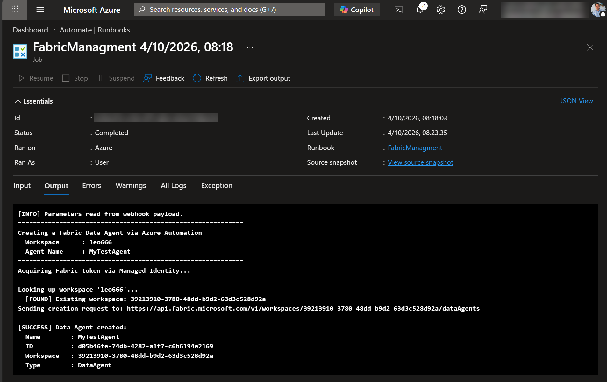
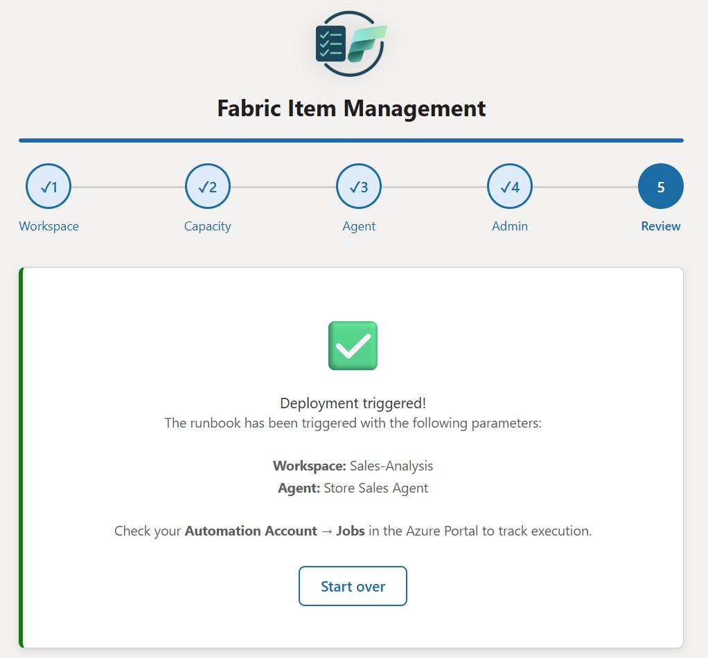
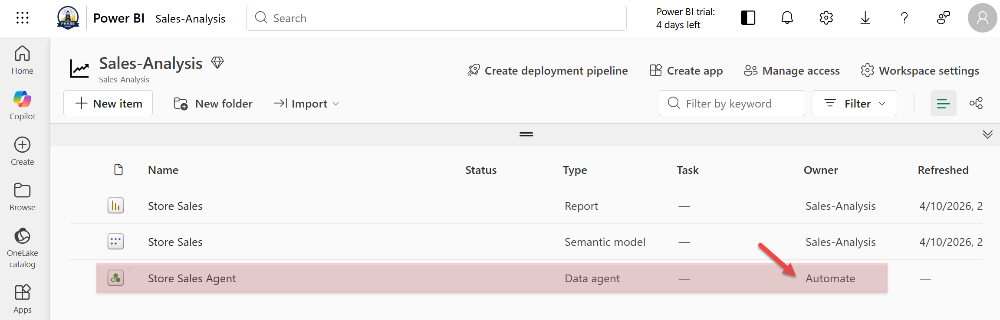

<p align="center"></p>

# Fabric Item Management

> **Enabling the controlled use of specific Microsoft Fabric items without exposing them to the entire organization.**

A template solution that lets end users provision Fabric items (starting with Data Agents) through a guided web wizard without ever needing direct Fabric creation rights. Governance, cost control, and naming conventions are enforced server-side by an Azure Automation Runbook running under a Managed Identity.

>⚠️ Caution: This solution accelerator is not an official Microsoft product. It was developed as a proof of concept to demonstrate a possible approach. As such, no official support is provided, and there is a potential risk of failures or breaking changes.

---

## Context & Problem

Many organizations want to leverage Microsoft Fabric items such as Data Agents, Lakehouses, and Notebooks without exposing the full Fabric surface area to every user. Their main concerns typically include:
- Capacity overconsumption, especially in environments where Power BI workloads are already running
- Redundant investments, duplicating existing cloud or data platform capabilities
- Governance, including who can create which items, in which locations, and under which naming conventions

While security groups can be applied at the tenant or capacity level, this model remains all‑or‑nothing. In practice, this does not align with many real‑world scenarios for example, allowing users to create Data Agents on a specific capacity without granting them permission to create other items such as Notebooks.

⚠️ Important: I do not recommend disabling Fabric workloads. Microsoft Fabric was designed as a unified SaaS platform, where tightly integrated workloads deliver a consistent experience and maximum value. Although the need for more granular controls is well understood and actively monitored by the Product Group, it is not currently available.

This solution addresses a key question: *How can we enable targeted, controlled, and gradual access to specific Fabric items without compromising cost control, governance, or platform performance?*

---

## Quick Links

| | |
|---|---|
| 🏗️ [Architecture & How It Works](Docs/architecture.md) | Component diagram, data flow, security model |
| 🚀 [Deployment Guide](Docs/deployment-guide.md) | Run locally (open `index.html`) or deploy to Azure Static Web App |
| ✅ [Approval Workflow](Docs/approval-workflow.md) | Add a human-in-the-loop gate before provisioning |
| 🔧 [Troubleshooting](Docs/troubleshooting.md) | Common errors and fixes |
| 🔭 [Extending the Solution](Docs/extending.md) | Add new item types, audit logging, naming rules |

---

## What It Does

End users open a 5-step wizard in the browser and fill in a workspace name, optional capacity, agent name, and an optional admin user. The form POSTs a JSON payload to an Azure Automation Webhook. A Python Runbook running as a System-assigned Managed Identity handles all Fabric API calls server-side. The user never needs Fabric creation rights.

```
End user  →  Azure Static Web App (wizard)
                     │
                     │  POST JSON
                     ▼
          Azure Automation Webhook
                     │
                     ▼
          Azure Automation Runbook (Python 3.10)
          ├─► Fabric REST API  — Create workspace, assign capacity, create Data Agent
          └─► Microsoft Graph  — Resolve UPN → Object ID, assign workspace roles
```

---

## End-to-End Story

Meet **Leo**, a data analyst in his organization. He needs a Fabric Data Agent to let his colleagues query a dataset in natural language but he does not have permission to create items in Microsoft Fabric directly.

His IT administrator has already deployed this solution: an Azure Automation Runbook running under a Managed Identity, and a webhook URL shared with Leo (via email, a ticketing system, or any internal process the team chooses).

Here is how Leo provisions his Data Agent in minutes, without ever touching the Azure Portal or Fabric Admin settings.

---

### 1. Open the web app and choose an item type

Leo opens the web app in his browser. The welcome screen presents the available Fabric item types. He clicks **Data Agent** to get started.


---

### 2. Choose or create a workspace

Leo specifies whether to create a new Fabric workspace or reuse an existing one. He enters a workspace name. If the workspace already exists and the Managed Identity is a member, it will be reused; otherwise a new one is created automatically.


---

### 3. Assign a Fabric Capacity (optional)

For new workspaces, Leo can assign a dedicated Fabric capacity to isolate workloads or control costs. An IT workflow, driven by user input, can assign, modify, or validate this setup with Leo’s approval.


---

### 4. Name the Data Agent

Leo gives the Data Agent a name and an optional description and IT could enforce naming standards automatically.


---

### 5. Set an administrator (optional)

Leo can optionally designate a user by email address or Entra Object ID to receive the Admin role on the newly created workspace. The runbook resolves the UPN to an Object ID via Microsoft Graph automatically.


---

### 6. Review, paste the webhook URL, and deploy

Leo reviews his configuration, pastes the webhook URL that his administrator shared with him, and clicks **🚀 Deploy**. The browser sends the parameters directly to Azure Automation — no server infrastructure required on Leo's side.


> The webhook URL is the only secret in this solution. It should be shared through a secure channel and rotated when needed.

---

### 7. The runbook executes in Azure Automation

Behind the scenes, the Azure Automation Runbook is triggered immediately. It creates the workspace, assigns the capacity, creates the Data Agent, and grants roles all via REST API calls authenticated with the Managed Identity. Leo sees a confirmation in the web app that the deployment was triggered.


IT can track execution in the Azure Portal under **Automation Account → Jobs**.





---

### 8. The Data Agent is ready in Fabric

The Data Agent appears instantly in Leo’s workspace, fully usable, without ever granting him Fabric item creation rights.



Here is the key insight of this solution: **creation rights and ownership are two different things**. Leo never had and still does not have permission to create Fabric items. But once the Managed Identity has provisioned the workspace and the Data Agent on his behalf, Leo is granted the **Admin role** on the workspace. From that point on, he has full control over the items inside it.

Leo can now open the Data Agent in Microsoft Fabric, connect it to his data sources, define its instructions and behaviour, and iterate on its configuration just like any workspace owner would. The governance boundary was enforced at creation time; everything that follows is entirely in Leo's hands.

---

## Security at a Glance

- **No credentials stored** : Authentication uses the System-assigned Managed Identity only.
- **Webhook URL is the only secret** : Treat it like a password; do not commit it to source control.
- **Least-privilege** : The Managed Identity has only `User.Read.All` on Graph and membership on target Fabric workspaces.
- **XSS prevention** : All user input is passed through `escapeHtml()` before DOM insertion.

See [Architecture](Docs/architecture.md) for the full security model.

---

## Authors

Co-designed with the invaluable input of [Emilie Beau](https://www.linkedin.com/in/emilie-beau/) and [Christopher Maneu](https://www.linkedin.com/in/cmaneu/), and accelerated using VS Code Copilot and Claude Sonnet 4.6.

---

**Built with ❤️ for the Microsoft Fabric community**


